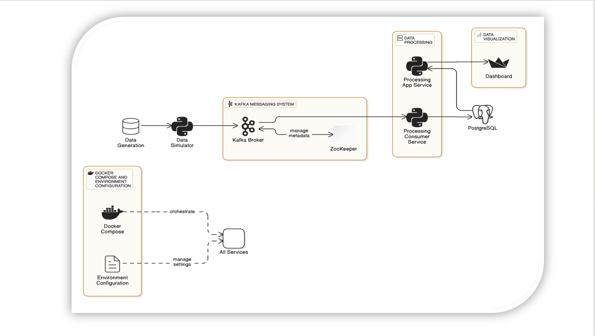

# Real-Time Data Processing Pipeline

This repository contains a **real-time data processing pipeline** using **Apache Kafka**, **PostgreSQL**, and **Python** microservices. The pipeline simulates financial transactions, processes them in real time, and visualizes data via a web dashboard.

---

## Overview

The system consists of the following microservices:

- **Data Simulator**: Generates mock financial transactions and publishes them to a Kafka topic.
- **Kafka Broker & ZooKeeper**: Manages message streaming and coordination.
- **Processing Consumer Service**: Consumes Kafka messages and inserts transactions into PostgreSQL.
- **Processing App Service (FastAPI)**: Provides APIs to fetch transaction data.
- **PostgreSQL**: Stores transaction data.
- **Dashboard (Streamlit)**: Visualizes transactions in real time.

You can deploy this system **manually** or via **Docker Compose**.

---

## System Architecture



1. **Data Generation**: The Data Simulator generates mock financial transactions.
2. **Kafka Messaging System**: Kafka + ZooKeeper handle message streaming and topic management.
3. **Data Processing**: 
   - **Processing App (FastAPI)**: Provides a REST API for transaction data.
   - **Processing Consumer Service**: Consumes Kafka messages and inserts data into PostgreSQL.
4. **Data Visualization**: A Streamlit dashboard connects to PostgreSQL (or via FastAPI) to visualize transactions in real time.

---

## 1️⃣ Clone the Repository

```bash
# Clone the repository
git clone [https://github.com/<your-username>/<repo-name>.git](https://github.com/Abhi081827/E-Commerce-Real-Time-Data-Processing.git)

# Navigate into the project directory
cd E-Commerce-Real-Time-Data-Processing
```

---

## 2️⃣ Running with Docker

### A. Install Docker & Docker Compose

- **Windows**: Install Docker Desktop from [Docker Official Site](https://www.docker.com/products/docker-desktop).
- **Linux**:
  ```bash
  sudo apt update
  sudo apt install docker.io docker-compose -y
  ```

### B. Start the Services with Docker Compose

1. **Check Docker installation**:
   ```bash
   docker --version
   docker-compose --version
   ```
2. **Run the pipeline**:
   ```bash
   docker-compose up --build
   ```
   This will:
   - Start Kafka & ZooKeeper
   - Initialize PostgreSQL
   - Launch the Data Simulator & Kafka Consumer
   - Deploy FastAPI & Streamlit Dashboard

3. **Verify Services**:
   - **Kafka Topics**:
     ```bash
     docker-compose exec kafka kafka-topics.sh --list --bootstrap-server kafka:9092
     ```
   - **PostgreSQL**:
     ```bash
     docker-compose exec db psql -U myuser -d financial_db
     ```
   - **API Check**:
     ```bash
     curl http://localhost:8080/transactions/all
     ```
   - **Dashboard**: Open [http://localhost:8501](http://localhost:8501) in your browser.

4. **Stop Services**:
   ```bash
   docker-compose down -v
   ```
   This stops all containers and removes volumes.

---

## 3️⃣ Running Manually

### Windows Setup

#### A. Install Kafka & ZooKeeper
1. Download **Apache Kafka** from [Kafka Downloads](https://kafka.apache.org/downloads).
2. Extract it to `C:\kafka\`.
3. Ensure **Java** is installed:
   ```powershell
   java -version
   ```
4. Configure:
   - `C:\kafka\config\zookeeper.properties`:
     ```
     dataDir=C:/kafka/zookeeper-data
     ```
   - `C:\kafka\config\server.properties`:
     ```
     log.dirs=C:/kafka/kafka-logs
     advertised.listeners=PLAINTEXT://localhost:9092
     ```
5. Start Services:
   ```powershell
   cd C:\kafka
   .\bin\windows\zookeeper-server-start.bat .\config\zookeeper.properties
   ```
   (Open a new PowerShell window)
   ```powershell
   cd C:\kafka
   .\bin\windows\kafka-server-start.bat .\config\server.properties
   ```
6. Verify:
   ```powershell
   .\bin\windows\kafka-topics.bat --list --bootstrap-server localhost:9092
   ```

#### B. Install PostgreSQL
1. Download from [PostgreSQL Official Site](https://www.postgresql.org/download/windows/).
2. Install and set a password for `postgres`.
3. Create the DB and user:
   ```sql
   CREATE DATABASE financial_db;
   CREATE USER myuser WITH PASSWORD 'mypassword';
   GRANT ALL PRIVILEGES ON DATABASE financial_db TO myuser;
   ```

#### C. Install Python & Dependencies
1. Download **Python 3.8+** from [Python.org](https://www.python.org/downloads/).
2. Create a virtual environment:
   ```powershell
   python -m venv venv
   venv\Scripts\activate
   ```
3. Install libraries:
   ```powershell
   pip install -r requirements.txt
   ```

---

### Linux Setup

#### A. Install Kafka & ZooKeeper
1. Update and install dependencies:
   ```bash
   sudo apt update && sudo apt upgrade -y
   sudo apt install default-jdk wget unzip -y
   ```
2. Download & install Kafka:
   ```bash
   wget https://downloads.apache.org/kafka/3.6.0/kafka_2.13-3.6.0.tgz
   tar -xzf kafka_2.13-3.6.0.tgz
   mv kafka_2.13-3.6.0 /opt/kafka
   ```
3. Configure:
   - `server.properties`:
     ```
     log.dirs=/var/lib/kafka-logs
     advertised.listeners=PLAINTEXT://localhost:9092
     ```
4. Start Kafka & ZooKeeper:
   ```bash
   cd /opt/kafka
   bin/zookeeper-server-start.sh config/zookeeper.properties &
   bin/kafka-server-start.sh config/server.properties &
   ```

#### B. Install PostgreSQL
1. ```bash
   sudo apt install postgresql postgresql-contrib -y
   ```
2. Start & enable:
   ```bash
   sudo systemctl start postgresql
   sudo systemctl enable postgresql
   ```
3. Create DB and user:
   ```sql
   CREATE DATABASE financial_db;
   CREATE USER myuser WITH PASSWORD 'mypassword';
   GRANT ALL PRIVILEGES ON DATABASE financial_db TO myuser;
   ```

#### C. Install Python & Dependencies
1. ```bash
   sudo apt install python3 python3-venv python3-pip -y
   ```
2. Create a virtual environment:
   ```bash
   python3 -m venv venv
   source venv/bin/activate
   ```
3. Install libraries:
   ```bash
   pip install -r requirements.txt
   ```

---

## 4️⃣ Running Python Services

Once Kafka & PostgreSQL are running, launch each service in separate terminals (or background processes):

```bash
# Data Simulator
python data_simulator.py

# Kafka Consumer
python consumer.py

# FastAPI Service
uvicorn app:app --host 0.0.0.0 --port 8080 --reload

# Streamlit Dashboard
streamlit run dashboard.py
```

---

## 5️⃣ Verification

- **Check Kafka Topic**:
  ```bash
  kafka-console-consumer.sh --topic transactions_topic --from-beginning --bootstrap-server localhost:9092
  ```
- **Check PostgreSQL**:
  ```sql
  SELECT * FROM transactions;
  ```
- **Test FastAPI**:
  ```bash
  curl http://localhost:8080/transactions/all
  ```
- **Open Dashboard**:  
  [http://localhost:8501](http://localhost:8501)
